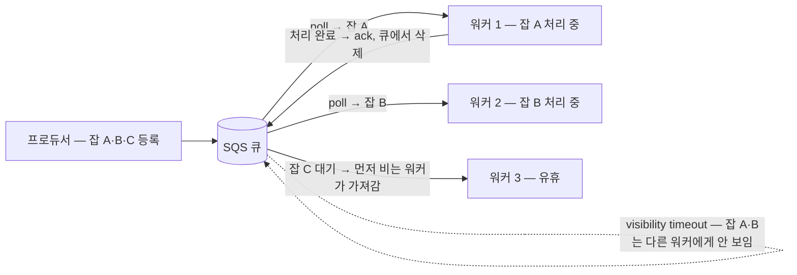

메시지 큐를 도입하는 글은 대부분 "프로듀서가 잡을 넣고, 컨슈머가 꺼내 처리한다"까지만 다룬다. 실제로 잡을 큐에 **넣는** 쪽은 어렵지 않다. 까다로운 것은 **소비하는 워커를 신뢰성 있게 만드는 일**이다. 워커가 처리 도중 죽으면? 같은 메시지가 두 번 배달되면? 배포하느라 프로세스를 내려야 하면? 이런 질문에 답이 없는 워커는 언젠가 잡을 잃어버리거나, 같은 작업을 두 번 실행해 비용을 두 배로 태운다.

최근 비동기 처리 파이프라인을 설계하면서 이 질문들을 하나씩 마주쳤고, AWS SQS + Python asyncio로 구현하며 정리한 내용을 공유한다. **SQS는 예시일 뿐, 여기서 다루는 고려 포인트는 RabbitMQ, Redis Streams 등 어떤 브로커를 쓰든 동일하게 적용된다.**

대상 독자는 메시지 큐 도입을 앞둔 백엔드 엔지니어다. 큐의 기본 개념(프로듀서/컨슈머)과 Python asyncio를 어느 정도 안다고 가정한다.

## 배경 — 어떤 문제였나

하나의 잡(job)이 **20개가 넘는 외부 API 호출로 쪼개지는** 음성 합성(TTS) 파이프라인이었다. 텍스트를 세그먼트 단위로 나눠 각각 TTS 합성을 요청하고, 응답 파일이 **전부 모여야** 병합해서 결과물을 만들 수 있다. 이 요구사항은 세 가지 어려움을 동반한다.

1. **요청이 유실될 수 있다** — 세그먼트 하나라도 빠지면 잡 전체가 미완성이다.
2. **처리가 언제 끝날지 모른다** — 외부 API 응답 시간은 예측할 수 없고, 잡 하나가 몇 분씩 걸릴 수 있다.
3. **재시작하면 끝나지 않은 잡을 되살려야 한다** — 배포·장애로 워커가 내려가도 잡이 증발해선 안 된다.

처리 흐름은 이렇다: 잡 안의 세그먼트를 모두 요청하고 응답을 기다린다 → 실패한 세그먼트는 재시도한다 → 그래도 실패하면 Failed로 기록한다. 이 흐름을 안전하게 돌리기 위해 필요했던 것이 아래 6가지다.

## 1. 잡 배분 — 경쟁 소비자 (Competing Consumers)

잡 사이에 순서가 중요하지 않다면(세그먼트별로 요청하고 나중에 병합하는 구조가 그렇다), 처리량을 높이는 가장 단순한 방법은 **비어 있는 워커가 큐에서 바로 잡을 가져가는** 경쟁 소비자 패턴이다.

```python
while not stop.is_set():
    queued = await queue.poll(max_messages=1, wait_seconds=_POLL_WAIT_SECONDS)
    for job in queued:
        await _handle(queue, job)
```

단순한 루프지만 파라미터의 의미를 정확히 아는 것이 중요하다.

- **`wait_seconds` — long polling**: 큐가 비어 있을 때 즉시 빈 응답을 받는 대신, 최대 이 시간만큼 메시지를 기다렸다가 반환한다(SQS 상한 20초). 빈 큐에서 루프가 헛돌며 호출 건당 과금되는 것을 막는다.
- **`max_messages`**: "이만큼 모일 때까지 기다려라"가 **아니라** 한 번에 담아 올 상한이다. 메시지가 1개라도 생기면 그 시점 것만 담아 즉시 반환한다. `max_messages=1`은 잡을 쟁여두지 않고 하나씩 가져간다는 뜻으로, 경쟁 소비자 구조와 맞는 선택이다.
- **visibility timeout**: 큐에서 poll하면 이 시간 동안 해당 메시지가 다른 워커에게 보이지 않는다. "대체로 한 워커만 잡을 받게 하는" **1차 방어**다. (완전한 방어가 아닌 이유는 4번에서 다룬다.)

빈 워커가 큐에서 바로 잡을 가져가고, poll된 잡은 visibility timeout 동안 다른 워커에게 보이지 않는다(점선). 처리가 끝나면 ack로 큐에서 삭제된다.



"visibility timeout"은 SQS 용어지만 유사 개념은 다른 브로커에도 있다. Redis Streams는 consumer group의 pending 목록과 `XCLAIM`/`XAUTOCLAIM`으로, RabbitMQ는 unacked 메시지의 재전달로 같은 역할을 한다. 단순 Redis 리스트(LPUSH/RPOP)에는 없으므로 직접 구현해야 한다 — 큐를 Redis 리스트로 시작하려 한다면 이 지점을 먼저 고민해보길 권한다.

## 2. Graceful Shutdown — 안전하게 내리기

배포·스케일 다운은 일상적으로 일어난다. 워커 종료 시 **새 잡은 받지 않고, 처리 중이던 잡만 마무리하고 종료**해야 한다. "영업 종료 팻말을 걸고, 현재 손님까지만 응대"하는 방식이다.

```python
stop = asyncio.Event()                                   # ① 팻말
for sig in (signal.SIGINT, signal.SIGTERM):
    loop.add_signal_handler(sig, stop.set)               # ② 신호 → 팻말만 세움

while not stop.is_set():                                 # ③ 새 잡 안 받음
    ...
finally:
    sweeper.cancel()                                     # ④ 곁가지 정리
    await asyncio.gather(sweeper, return_exceptions=True)
```

핵심은 시그널 핸들러가 **팻말(`Event`)만 세우고 즉시 리턴**한다는 것이다. 핸들러 안에서 정리 작업을 하지 않고, 메인 루프가 자연스럽게 빠져나오면서 마무리하게 한다.

받아야 할 시그널은 두 가지다.

- **SIGINT** (interrupt) — 터미널에서 **Ctrl+C**를 눌렀을 때. 주로 로컬 개발·수동 실행 중에 발생한다.
- **SIGTERM** (terminate) — `kill`의 기본 시그널. **배포·재시작·스케일 다운** 시 Kubernetes/ECS, systemd, `docker stop`이 보내는 정상 종료 요청이다. 유예 시간 안에 끝나지 않으면 SIGKILL(강제 종료, 핸들러로 잡을 수 없음)이 따라온다.

즉 프로덕션에서 실제로 중요한 것은 SIGTERM이다. SIGTERM을 무시하는 워커는 배포 때마다 처리 중이던 잡을 강제로 끊긴다.

## 3. ack와 재시도 — Heartbeat로 Lease 연장

잡 하나가 몇 분씩 걸리면 문제가 생긴다. visibility timeout(예: 60초)이 처리 도중 만료되면 메시지가 다시 보이게 되고, 다른 워커가 같은 잡을 받아간다. 이를 막으려면 **heartbeat가 주기적으로 lease를 연장**해 "아직 살아서 처리 중"임을 브로커에 알려야 한다.

```python
async def _heartbeat(queue, job):
    while True:
        await asyncio.sleep(_HEARTBEAT_INTERVAL_SECONDS)   # 20초마다
        await queue.extend_lease(job, _LEASE_SECONDS)      # 60초로 연장
```

`extend_lease`는 프로젝트에서 붙인 이름이고, 실체는 SQS의 **`ChangeMessageVisibility`** API다.

```python
sqs.change_message_visibility(
    QueueUrl=..., ReceiptHandle=..., VisibilityTimeout=60
)
```

주의할 점: 이 API는 남은 시간에 **더하는** 게 아니라, **호출 시점부터 visibility timeout을 지정한 값으로 재설정**한다. "20초마다 60초로 재설정"이면 heartbeat가 살아 있는 한 lease는 만료되지 않는다.

처리 결과가 나오면 `heartbeat.cancel()` 후 `await asyncio.gather(heartbeat, return_exceptions=True)`로 태스크를 정리하고, 잡 결과를 기록한 뒤 `queue.ack(...)`로 메시지를 큐에서 제거한다. 실패한 잡은 여러 번 재시도를 거치고, 그래도 실패하면 Failed로 기록한다.

## 4. 멱등성 — DB 선착순 Claim

**문제**: SQS는 at-least-once 전달이라 드물게 같은 메시지가 워커 두 명에게 간다. 막지 않으면 외부 API 호출이 중복되어 **비용이 두 배**로 나가고, 같은 결과물이 두 번 만들어진다.

### 왜 중복 배달이 생기나 — 배달 보장의 세 등급

큐의 배달 보장에는 세 등급이 있다.

- **at-most-once (최대 한 번)** — 중복은 절대 없지만, 가끔 **유실**될 수 있다.
- **at-least-once (최소 한 번)** — 유실은 절대 없지만, 가끔 **중복**될 수 있다. ← SQS의 약속
- **exactly-once (정확히 한 번)** — 이상적이지만 전달 계층에서는 불가능하다.

exactly-once가 왜 불가능한지는 초대장 비유로 이해할 수 있다. 초대장을 보냈는데 답장이 없으면, **배달 중에 초대장이 사라진 건지, 잘 받았는데 답장만 사라진 건지 구별할 수 없다.** 다시 보내면 두 장 받을 수 있고(중복), 안 보내면 못 받았을 수 있다(유실) — 둘 다 피할 방법은 없다. SQS는 "못 받는 것보단 두 장 받는 게 낫다"를 골랐고, 두 장째를 걸러내는 일을 받는 쪽 책임으로 넘겼다. 그 걸러내기가 바로 claim이다.

### 해결 — 원자적 UPDATE로 선착순 판정

처리를 시작하기 전에 DB에서 원자적 UPDATE로 "내가 이 잡의 처리자"임을 선착순으로 판정받는다.

```sql
UPDATE jobs SET status = 'PROCESSING', started_at = NOW()
WHERE id = :job_id AND status = 'REQUESTED'   -- 아직 아무도 안 집은 경우에만
```

- 워커 A: `rowcount == 1` → "내가 찜했다" → 처리 진행
- 워커 B: 조건 불일치로 `rowcount == 0` → 조용히 물러나고(SKIPPED) 메시지만 ack

```python
claimed = await self.jobs.claim(job_id, self.stale_processing_seconds)
if claimed is None:
    return ProcessOutcome.SKIPPED
await self.uow.commit()  # 점유를 즉시 확정
```

**즉시 commit하는 이유**: 커밋 전의 UPDATE는 내 트랜잭션에서만 보이는 임시 변경이다. 잡 처리가 몇 분씩 걸리는 동안 커밋을 미루면 (1) 다른 워커가 같은 잡을 claim하려다 row lock에 걸려 몇 분간 대기하고, (2) 진행률 조회 API나 스위퍼가 여전히 REQUESTED 상태로 본다. 찜 도장을 찍자마자 커밋해서 "처리 중"임을 모두에게 공표해야 한다.

**좀비 잡 회복**: claim 조건에는 하나가 더 있다 — "PROCESSING인데 `started_at`이 임계값(예: 600초)보다 오래됐으면 재점유 허용". 워커가 잡을 찜한 직후 죽으면 상태가 영원히 PROCESSING으로 남는데, 재배달받은 워커가 "10분 넘게 소식이 없으니 죽은 것으로 간주하고 이어받는" 회복 장치다.

정리하면 — **visibility timeout이 1차 방어**(대체로 한 명만 받게), **claim이 최종 방어**(받아도 한 명만 처리하게), **즉시 commit이 판정 결과의 공표**다.

## 5. 스위퍼 (Sweeper) — 방치된 잡 되살리기

REQUESTED 상태인데 일정 기간 처리되지 않은 잡을 찾아 **큐에 다시 등록**하는 백그라운드 태스크다. 메시지 유실이나 워커 재시작으로 끝나지 않은 잡을 되살린다. 큐의 배달 보장만 믿지 않고, **DB의 잡 상태를 진실의 원천(source of truth)으로 삼아** 주기적으로 대조하는 안전망이다. graceful shutdown 시 함께 cancel한다.

## 6. DLQ (Dead Letter Queue) — 최후의 수용소

DB 다운이나 인프라 장애로 **처리 결과를 기록조차 못 하는** 메시지가 흘러가는 곳이다. 통상 DLQ는 최대 수신 횟수(`maxReceiveCount`)를 초과한 메시지가 자동으로 이동되는 큐를 가리키며, SQS는 이를 기본 기능으로 제공한다. DLQ에 쌓인 메시지는 버그 분석의 단서가 되고, 원인 해소 후 다시 원본 큐로 흘려보낼(redrive) 수 있다.

## 정리 — 워커 설계 체크리스트

메시지 큐 워커를 만들 때 스스로에게 던져야 할 질문으로 정리하면 이렇다.

| 축 | 질문 | 이 글의 답 |
|---|---|---|
| 경쟁 소비자 | 잡을 어떻게 배분하나? | 빈 워커가 바로 가져가는 poll 루프 (long polling) |
| Graceful shutdown | 배포 때 처리 중인 잡은? | SIGTERM → 팻말만 세우고 하던 잡 마무리 |
| Heartbeat | 잡이 오래 걸리면? | 주기적 lease 연장 (`ChangeMessageVisibility`) |
| 멱등성 claim | 같은 메시지가 두 번 오면? | DB 원자적 UPDATE 선착순 + 즉시 commit |
| 스위퍼 | 잡이 증발하면? | DB 상태 기준으로 미처리 잡 재등록 |
| DLQ | 기록조차 못 하면? | maxReceiveCount 초과 시 자동 격리 |

핵심 takeaway:

1. **넣기보다 소비가 어렵다.** 큐 도입 검토는 워커의 실패 시나리오 검토와 같은 말이다.
2. **exactly-once는 전달 계층에서 불가능하다.** at-least-once를 받아들이고, 중복 제거는 컨슈머의 멱등성(claim)으로 해결한다.
3. **방어는 겹겹이 둔다.** visibility timeout(1차) → claim(최종) → 스위퍼(회복) → DLQ(최후). 하나의 메커니즘에 전부 걸지 않는다.
4. **브로커가 달라도 질문은 같다.** SQS의 visibility timeout, Redis Streams의 XCLAIM, RabbitMQ의 unacked 재전달은 모두 같은 문제의 답이다.
